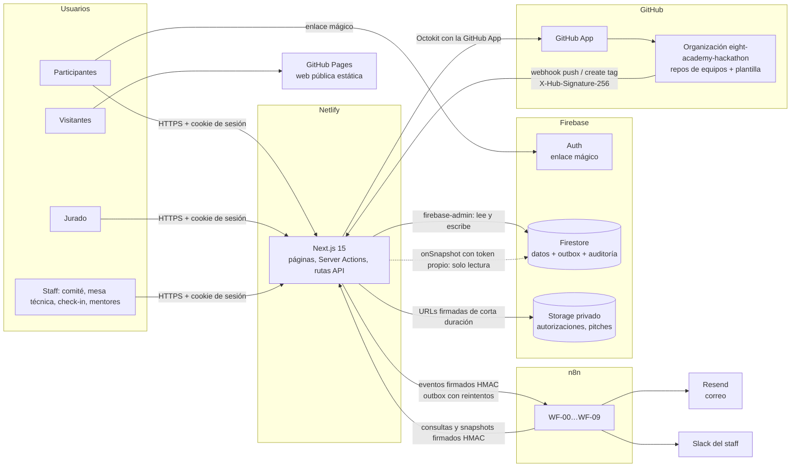
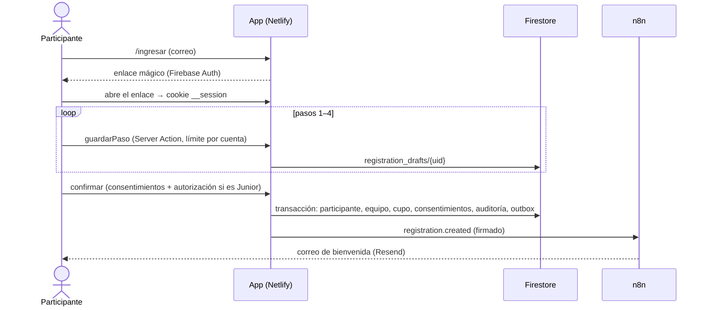

# Arquitectura

## Vista general

## Principios

1. **El cliente solo lee.** Las reglas de Firestore niegan toda escritura desde el navegador. Cada
   cambio pasa por una Server Action o ruta API que valida con Zod, verifica el rol y escribe la
   auditoría en el mismo batch (`lib/audit.ts`).
2. **Un evento, una transacción.** El cambio y su evento hacia n8n se guardan juntos en
   `event_outbox`; el envío ocurre después del commit y WF-00 reintenta lo que no llegó (D-19).
3. **Firmas en todas las fronteras.** App → n8n y n8n → app: HMAC-SHA256 sobre
   `timestamp.cuerpo`, ventana de 5 minutos (D-18). GitHub → app: `X-Hub-Signature-256`.
4. **Fechas en un solo lugar.** `config/event.ts` define agenda, fases y plazos; `ahora()` permite
   simular la fecha solo con emuladores (D-16). n8n pregunta a la app en vez de repetir reglas (D-39).
5. **Datos mínimos.** n8n recibe solo lo necesario para cada envío, el jurado no ve contactos, las
   exportaciones omiten contacto salvo para admin y todo se anonimiza a los 12 meses (D-43).

## Flujos principales

### Registro

### Repositorios y entrega

- El equipo registra su repo; la app lo valida con la GitHub App (organización, patrón
  `edutech26-t{1|2|3}-{slug}`, creado después del kick-off).
- WF-04 pide `POST /api/github/snapshot` cada 15 minutos; el webhook de la organización registra
  al instante cualquier movimiento del tag `entrega`.
- Al entregar, la app resuelve el tag, toma un snapshot final y calcula la admisibilidad A1–A5.

### Jurado y resultados

- Cada juez evalúa solo los equipos de su sala; el total se calcula con `lib/scoring.ts`.
- El comité cierra la sala (bloquea puntajes), normaliza por sala, elige finalistas, resuelve
  empates y publica. `results.published` dispara los certificados de WF-09.

## Datos (Firestore)

| Colección | Contenido | Quién lee desde el cliente |
| --- | --- | --- |
| `participants`, `teams`, `team_members` | Inscripción y equipos | El propio participante y su equipo |
| `guardians`, `consents` | Representante legal, consentimientos con versión | Nadie (solo servidor, admin y comité) |
| `repositories`, `repo_snapshots`, `submissions`, `admissibility` | Seguimiento técnico | El equipo; staff según rol |
| `rooms`, `presentation_slots`, `judges`, `scores`, `conflicts` | Jurado | Cada juez, solo su sala y sus puntajes |
| `results`, `public_state` | Resultados y cronómetro | El equipo; `public_state` es público |
| `checkins`, `mentor_requests`, `announcements` | Operación | Staff |
| `audit_log`, `event_outbox`, `rate_limits`, `data_requests` | Soporte | Nadie (solo servidor) |

Las reglas están en `firestore.rules` y se prueban en `tests/rules/`.

## Dónde vive cada cosa

| Tema | Código |
| --- | --- |
| Sesión y roles | `lib/auth/session.ts`, `lib/auth/roles.ts`, `middleware.ts` |
| Registro | `lib/registro/servicio.ts`, `app/registro/` |
| GitHub | `lib/github.ts`, `lib/github/`, `app/api/github/` |
| Puntajes | `lib/scoring.ts`, `lib/jurado/servicio.ts` |
| Dashboard | `lib/dashboard/`, `app/admin/page.tsx` |
| n8n | `lib/n8n.ts`, `lib/eventos.ts`, `lib/n8n/`, `app/api/n8n/`, `scripts/generar-workflows.ts` |
| Seguridad | `next.config.ts` (cabeceras), `lib/seguridad/limite.ts`, `lib/hmac.ts`, `lib/log.ts` |
| Privacidad | `lib/privacidad/retencion.ts`, `app/privacidad/`, `app/admin/privacidad/` |
| Sitio estático | `lib/sitio.ts`, `scripts/build-pages.mjs`, `.github/workflows/pages.yml` |
